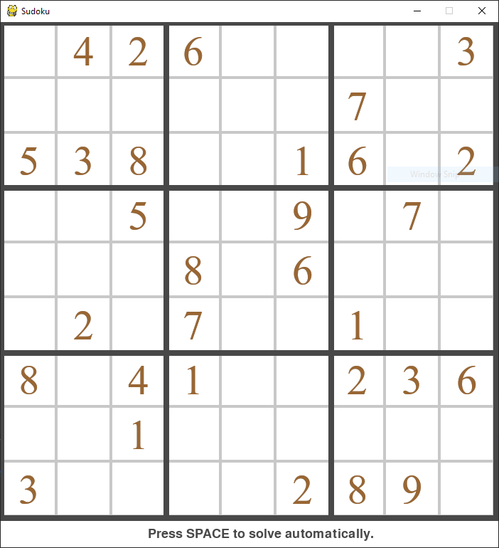
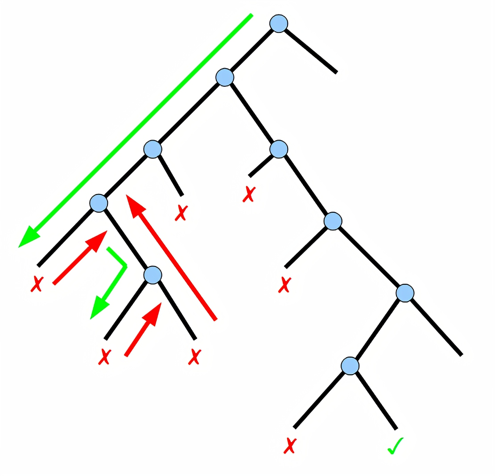
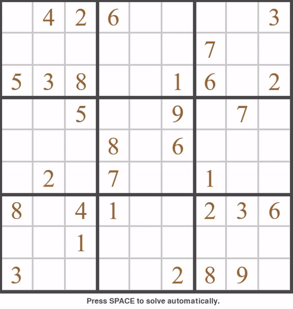

# Sudoku-Solver-Using-Backtracking
This an implementation of the infamous Backtracking Algorithm to solve the classic game of Sudoku

## Sudoku
Sudoku (数独, sūdoku, digit-single) (/suːˈdoʊkuː/, /-ˈdɒk-/, /sə-/, originally called Number Place) is a logic-based, combinatorial number-placement puzzle. In classic sudoku, the objective is to fill a 9×9 grid with digits so that each column, each row, and each of the nine 3×3 subgrids that compose the grid (also called "boxes", "blocks", or "regions") contain all of the digits from 1 to 9. The puzzle setter provides a partially completed grid, which for a well-posed puzzle has a single solution.

Completed games are always an example of a Latin square, including an additional constraint on the contents of individual regions. For example, the same single integer may not appear twice in the same row, column, or any of the nine 3×3 subregions of the 9×9 playing board.

French newspapers featured variations of the Sudoku puzzles in the 19th century, and the puzzle has appeared since 1979 in puzzle books under the name Number Place. However, the modern Sudoku only began to gain widespread popularity in 1986 when it was published by the Japanese puzzle company Nikoli under the name Sudoku, meaning "single number". It first appeared in a U.S. newspaper, and then The Times (London), in 2004, thanks to the efforts of Wayne Gould, who devised a computer program to rapidly produce unique puzzles.




## Backtracking
Backtracking is a general algorithm for finding all (or some) solutions to some computational problems, notably constraint satisfaction problems, that incrementally builds candidates to the solutions, and abandons a candidate ("backtracks") as soon as it determines that the candidate cannot possibly be completed to a valid solution.

### Description of the method
The backtracking algorithm enumerates a set of partial candidates that, in principle, could be completed in various ways to give all the possible solutions to the given problem. The completion is done incrementally, by a sequence of candidate extension steps.

Conceptually, the partial candidates are represented as the nodes of a tree structure, the potential search tree. Each partial candidate is the parent of the candidates that differ from it by a single extension step; the leaves of the tree are the partial candidates that cannot be extended any further.

The backtracking algorithm traverses this search tree recursively, from the root down, in depth-first order. At each node c, the algorithm checks whether c can be completed to a valid solution. If it cannot, the whole sub-tree rooted at c is skipped (pruned). Otherwise, the algorithm 
1.  checks whether c itself is a valid solution, and if so reports it to the user;
2. recursively enumerates all sub-trees of c. The two tests and the children of each node are defined by user-given procedures.



Therefore, the actual search tree that is traversed by the algorithm is only a part of the potential tree. The total cost of the algorithm is the number of nodes of the actual tree times the cost of obtaining and processing each node. This fact should be considered when choosing the potential search tree and implementing the pruning test.

### Pseudocode
In order to apply backtracking to a specific class of problems, one must provide the data P for the particular instance of the problem that is to be solved, and six procedural parameters, root, reject, accept, first, next, and output. These procedures should take the instance data P as a parameter and should do the following:

1. root(P): return the partial candidate at the root of the search tree.
2. reject(P,c): return true only if the partial candidate c is not worth completing.
3. accept(P,c): return true if c is a solution of P, and false otherwise.
4. first(P,c): generate the first extension of candidate c.
5. next(P,s): generate the next alternative extension of a candidate, after the extension s.
6. output(P,c): use the solution c of P, as appropriate to the application.

The backtracking algorithm reduces the problem to the call bt(root(P)), where bt is the following recursive procedure:

```
function backtrack(junction):
  
  if is_exit:
    return true
  for each direction of junction:
    if backtrack(next_junction):
      return true    
  
  return false
  ```




# Authors
- Dipanshu Shukla - Initial work - [Github](https://github.com/DipanshuShukla)
# License
This project is licensed under the MIT License - see the [LICENSE](https://github.com/DipanshuShukla/Sudoku-Solver-Using-Backtracking/blob/master/LICENCE) file for details
